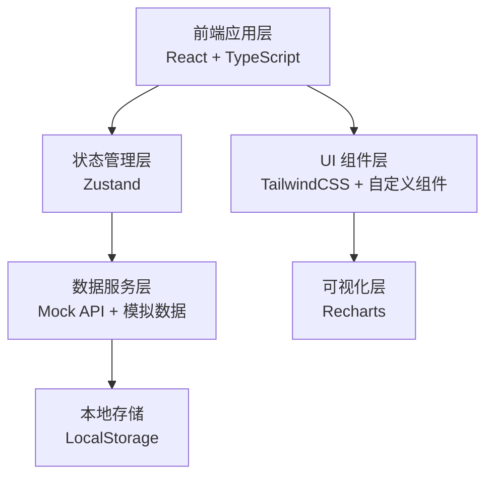

## 1. 架构设计



## 2. 技术选型

- **前端框架**: React 18 + TypeScript
- **构建工具**: Vite 5
- **样式方案**: TailwindCSS 3.4
- **状态管理**: Zustand
- **路由管理**: React Router v6
- **图表库**: Recharts
- **图标库**: Lucide React
- **数据模拟**: Mock 数据 + 本地存储

## 3. 目录结构

```
src/
├── components/          # 通用组件
│   ├── layout/         # 布局组件
│   ├── form/           # 表单组件
│   └── business/       # 业务组件
├── pages/              # 页面组件
│   ├── dashboard/      # 工作台首页
│   ├── create/         # 新建联办单
│   ├── arrange/        # 联办编排
│   ├── supplement/     # 补正处置
│   ├── exception/      # 异常退回
│   ├── archive/        # 办结归档
│   └── statistics/     # 统计分析
├── store/              # 状态管理
│   ├── useCaseStore.ts
│   └── useUserStore.ts
├── mock/               # 模拟数据
│   ├── cases.ts
│   └── templates.ts
├── types/              # TypeScript 类型定义
│   └── index.ts
├── utils/              # 工具函数
│   ├── format.ts
│   └── validate.ts
├── App.tsx
├── main.tsx
└── index.css
```

## 4. 路由定义

| 路由路径 | 页面名称 | 模块 |
|---------|----------|------|
| /dashboard | 工作台首页 | 叫号接件 |
| /create | 新建联办单 | 叫号接件 + 信息核验 |
| /arrange/:id | 联办编排 | 联办编排 |
| /supplement/:id | 补正处置 | 补正处置 |
| /exception/:id | 异常退回 | 异常退回 |
| /archive/:id | 办结归档 | 办结归档 |
| /statistics | 统计分析 | 统计分析 |
| /case/:id | 办件详情 | 通用 |

## 5. 数据模型

### 5.1 办件数据模型

```typescript
interface CaseInfo {
  id: string;           // 办件编号
  caseNo: string;       // 联办单号
  type: 'newborn' | 'parents' | 'other';  // 办事人类型
  status: 'pending' | 'verifying' | 'arranging' | 'supplement' | 'exception' | 'processing' | 'completed' | 'archived';
  applicant: {
    name: string;
    idCard: string;
    phone: string;
    relation: string;
  };
  babyInfo: {
    name: string;
    gender: 'male' | 'female';
    birthDate: string;
    birthCertificateNo: string;
  };
  parents: {
    father: {
      name: string;
      idCard: string;
      idCardVerified: boolean;
    };
    mother: {
      name: string;
      idCard: string;
      idCardVerified: boolean;
    };
    consistencyCheck: 'passed' | 'failed' | 'pending';
  };
  materials: MaterialItem[];
  selectedItems: SelectedItem[];
  supplements: SupplementItem[];
  exceptions: ExceptionItem[];
  createdAt: string;
  updatedAt: string;
  deadline: string;
}

interface MaterialItem {
  id: string;
  name: string;
  required: boolean;
  provided: boolean;
  category: string;
  remark: string;
}

interface SelectedItem {
  id: string;
  name: string;
  department: string;
  type: string;
  selected: boolean;
  scenario: string;
  handlingTime: number;
}

interface SupplementItem {
  id: string;
  materialName: string;
  reason: string;
  templateId: string;
  deadline: string;
  status: 'pending' | 'replied' | 'passed';
}

interface ExceptionItem {
  id: string;
  type: string;
  reason: string;
  submitter: string;
  reviewer: string;
  status: 'pending' | 'approved' | 'rejected';
  createdAt: string;
}
```

### 5.2 统计数据模型

```typescript
interface DailyStats {
  date: string;
  total: number;
  completed: number;
  supplement: number;
  exception: number;
}

interface ExceptionReasonStat {
  reason: string;
  count: number;
  percentage: number;
}

interface DepartmentStats {
  department: string;
  total: number;
  completed: number;
  avgTime: number;
}
```

## 6. 核心功能实现方案

### 6.1 叫号接件模块
- 叫号队列列表，展示待叫号/已叫号状态
- 快速建单：选择办事人类型 → 读取证件 → 自动填充
- 今日办件概览卡片

### 6.2 信息核验模块
- 电子证照读取模拟（按钮触发填充）
- 父母证件一致性自动比对逻辑
- 材料清单校验，缺失项红色高亮
- 校验结果可视化展示

### 6.3 联办编排模块
- 可选择的联办事项列表（公安/人社/医保/卫健）
- 常见情形下拉选择，自动勾选对应事项
- 一次告知单实时生成预览
- 办理时限汇总与倒计时

### 6.4 补正处置模块
- 标准话术模板库，支持一键插入
- 补正材料清单勾选
- 补正时限设置
- 补正通知发送模拟

### 6.5 异常退回模块
- 异常类型选择
- 提交复核流程
- 复核状态跟踪
- 退回处理记录

### 6.6 办结归档模块
- 纸质结果登记
- 电子结果登记
- 双登记状态标记
- 归档操作
- 办件流向时间轴可视化

### 6.7 统计分析
- 日办件统计折线图
- 高频退件原因饼图/柱状图
- 部门协同统计
- 办件流向桑基图/流程图

## 7. 状态管理设计

使用 Zustand 进行状态管理，核心 store 包括：
- `useCaseStore`：办件相关状态（列表、详情、筛选、操作方法）
- `useUserStore`：用户信息、权限
- `useUistore`：UI 全局状态（侧边栏折叠、主题等）

## 8. 样式与设计系统

- TailwindCSS 3 原子化 CSS
- 自定义主题色配置（政务蓝主题）
- 通用组件库（按钮、输入框、卡片、表格等）
- 统一的间距、字体、阴影规范
